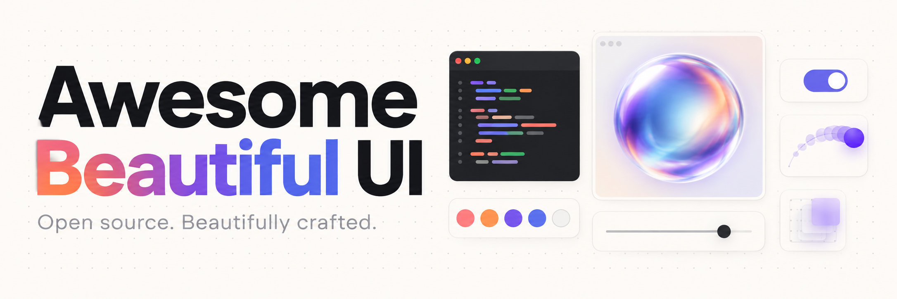

# Awesome Beautiful UI

> Open source UI that is beautiful and still being maintained.

**Browse it as a site: [mk668a.github.io/awesome-beautiful-ui](https://mk668a.github.io/awesome-beautiful-ui/)**

You find a gorgeous shader background or text effect, wire it into your app, and only later notice that the last commit was two years ago. Visual libraries are especially prone to this. Once the effect looks finished, the author moves on, and the next framework release breaks it.

This list covers the web (components, motion, WebGL), the terminal, and the small widgets in between. It has two rules.

1. **Still maintained.** A project stays in the main list only while it has had a push in the last three months. This is read from the GitHub API every time the list is regenerated, not judged by hand.
2. **Something of its own.** Each entry has an effect, an idea or a level of polish you would recognize. Another collection of copy-paste components with nothing distinctive does not get in.

Projects that fail rule 1 but are too good to forget are kept under [Quiet classics](#quiet-classics).

## How to read an entry

```md
- [Lenis](https://github.com/darkroomengineering/lenis) - Smooth inertial scrolling. `★ 16k` `MIT` `2026-10`
```

The three tags are the star count, the license, and the month of the last push. A ⚠ after the license means it is not a plain permissive license (copyleft, a custom license, or one GitHub could not identify), so read it before you fork or ship.

## Contents

- [Hidden gems](#hidden-gems)
- [Motion and text animation](#motion-and-text-animation)
- [Components and design systems](#components-and-design-systems)
- [WebGL and creative coding](#webgl-and-creative-coding)
- [Terminal and TUI](#terminal-and-tui)
- [Widgets and building blocks](#widgets-and-building-blocks)
- [Quiet classics](#quiet-classics)

<!-- LIST:START -->
_Last refreshed 2026-10-09. 137 active, 20 quiet._

## Hidden gems

Lesser known, each with one effect or idea that is clearly its own.

- [lucide-animated](https://github.com/pqoqubbw/icons) - Lucide-based icons that animate on hover. `★ 8.2k` `MIT` `2026-10`<br>
  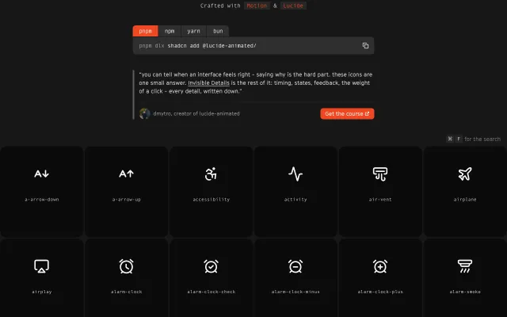 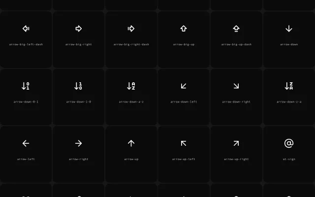 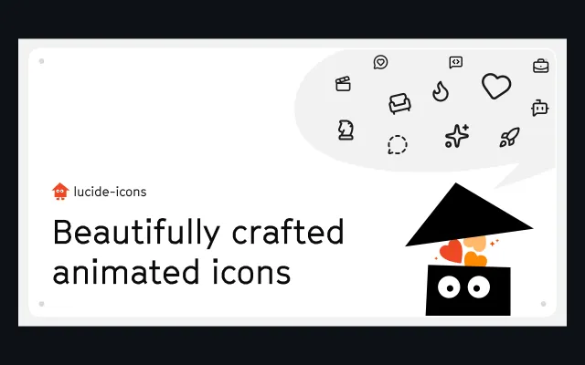
- [motion-primitives](https://github.com/ibelick/motion-primitives) - Named text and border effects (Text Morph, Scramble, Shimmer Wave, Border Trail) where the motion itself is the product. `★ 6.5k` `MIT` `2026-09`<br>
  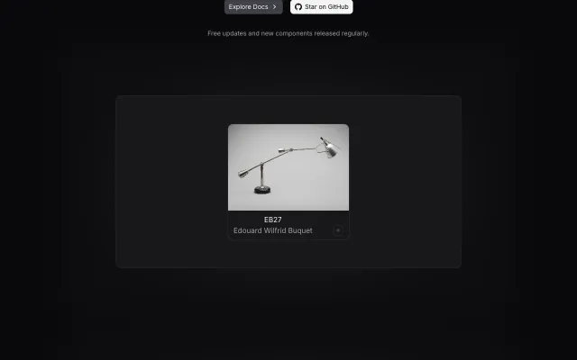 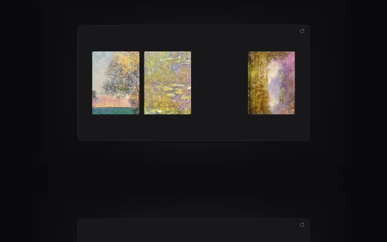 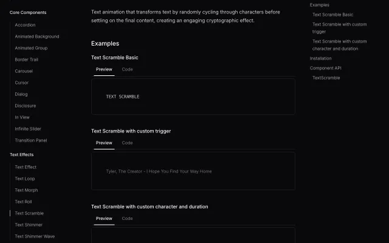
- [cult-ui](https://github.com/nolly-studio/cult-ui) - Shader-grade components: Warp Shader, Simplex Dithering, Neuro Noise, Fluted Glass, a 3D folded card. `★ 6.4k` `MIT` `2026-10`<br>
  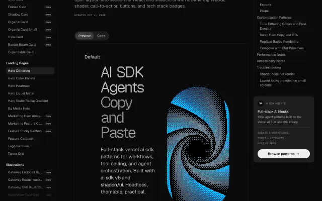 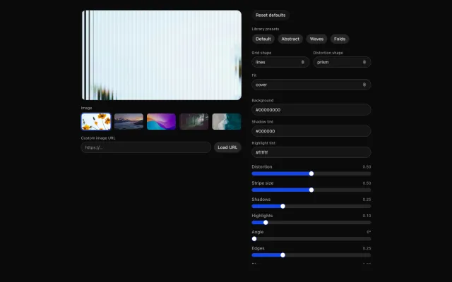 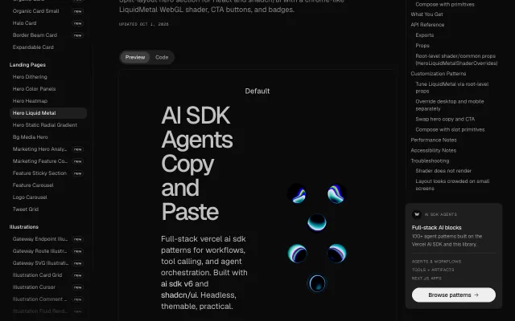 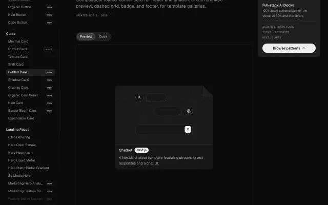
- [Chafa](https://github.com/hpjansson/chafa) - Turns images into terminal graphics: character art, Sixel, Kitty and truecolor output. `★ 5.3k` `LGPL-3.0 ⚠` `2026-10`<br>
  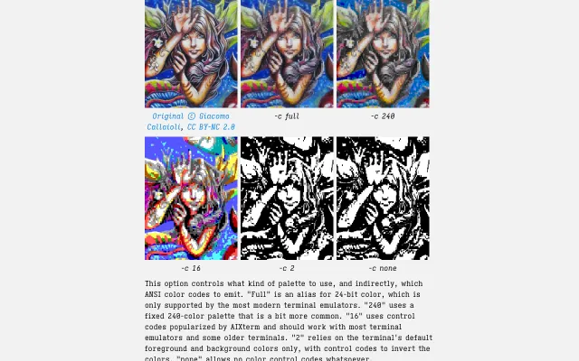 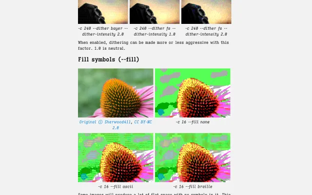 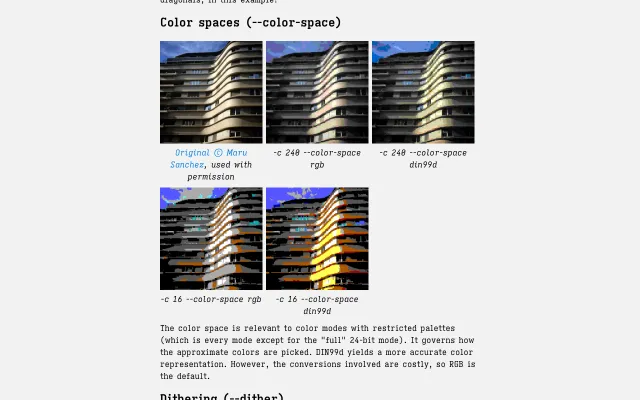 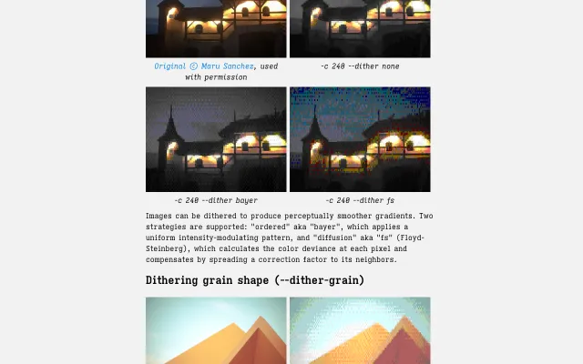
- [Atropos](https://github.com/nolimits4web/atropos) - Touch-friendly 3D parallax hover cards, from the author of Swiper. `★ 3.6k` `MIT` `2026-10`<br>
  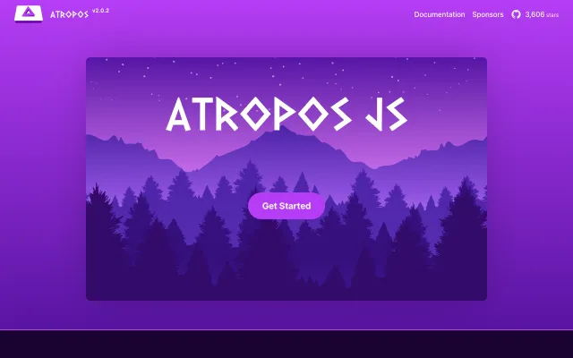 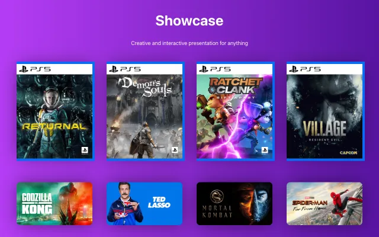 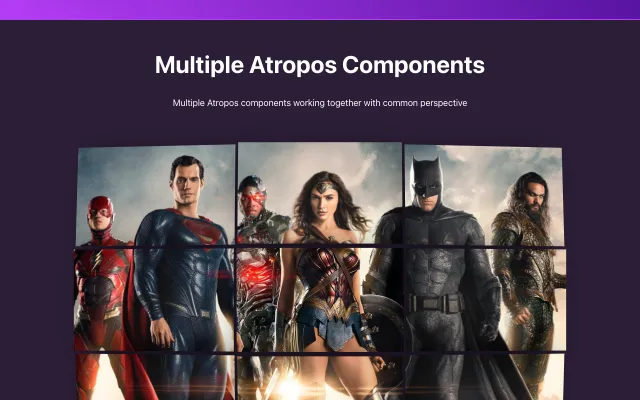
- [Paper Shaders](https://github.com/paper-design/shaders) - Zero-dependency canvas shaders: liquid metal, god rays, metaballs, voronoi, CMYK halftone and more. `★ 3.6k` `Apache-2.0` `2026-10`<br>
  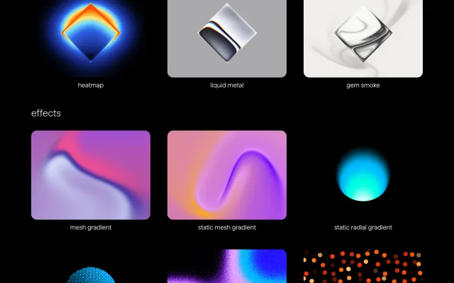 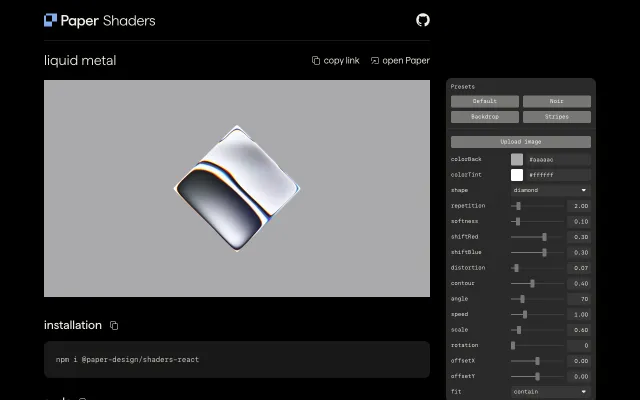 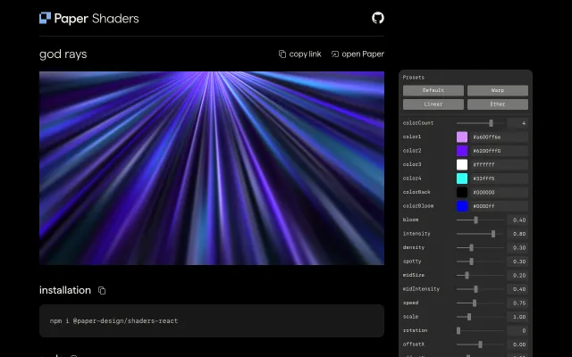 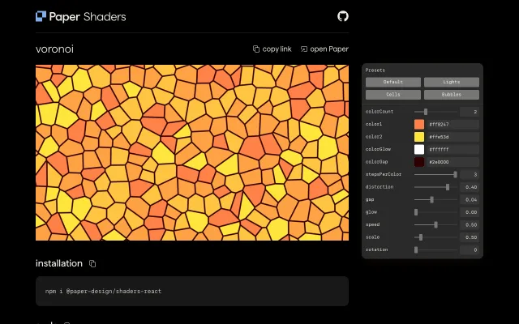
- [react-colorful](https://github.com/omgovich/react-colorful) - A color picker for React and Preact that weighs about 3 KB. `★ 3.6k` `MIT` `2026-09`<br>
  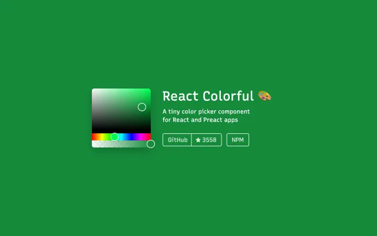 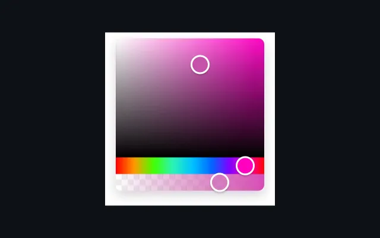 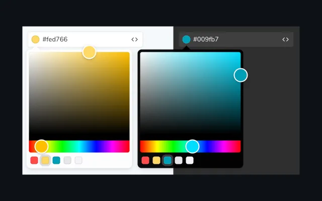
- [ShaderGradient](https://github.com/ruucm/shadergradient) - Animated 3D gradients with film grain, for React, Framer and Figma. `★ 2.8k` `license: see repo ⚠` `2026-09`<br>
  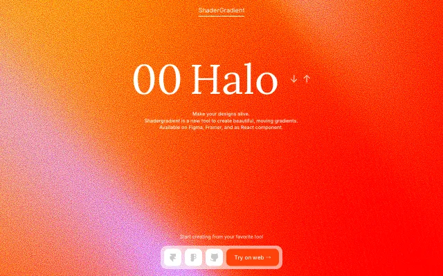 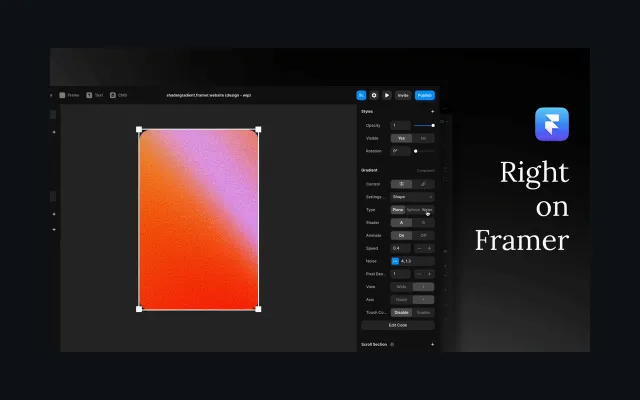 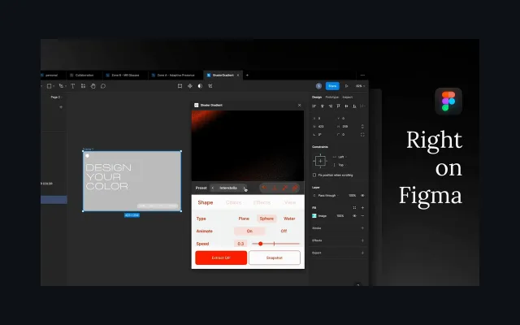
- [Kokonut UI](https://github.com/kokonut-labs/kokonutui) - Motion-led components with personality, such as an audio player with EQ and waveform, and glowing orb cards. `★ 2.1k` `MIT` `2026-08`<br>
  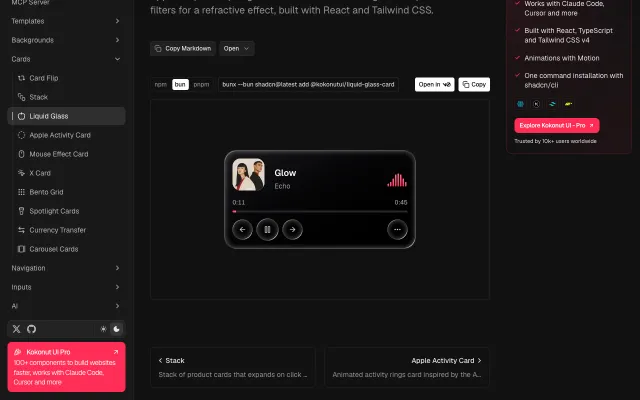 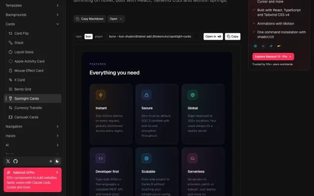 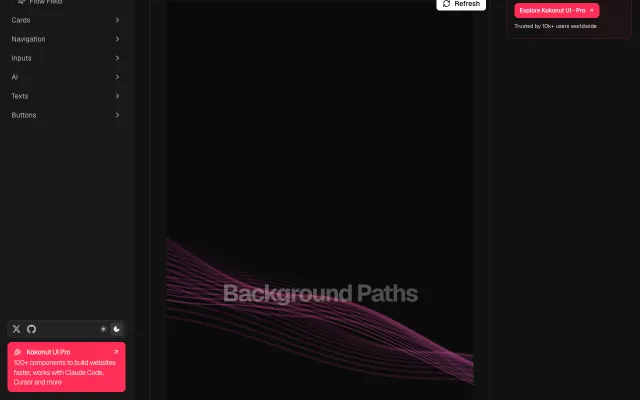 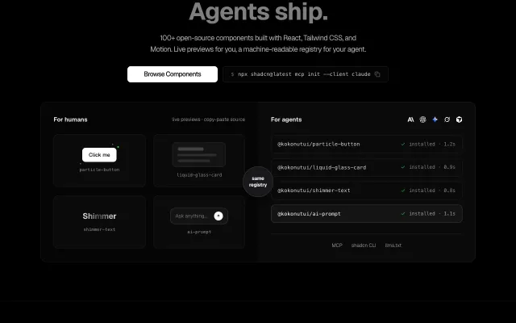
- [Cally](https://github.com/WickyNilliams/cally) - Small, feature-rich calendar built as framework-agnostic web components. `★ 1.7k` `MIT` `2026-07`<br>
  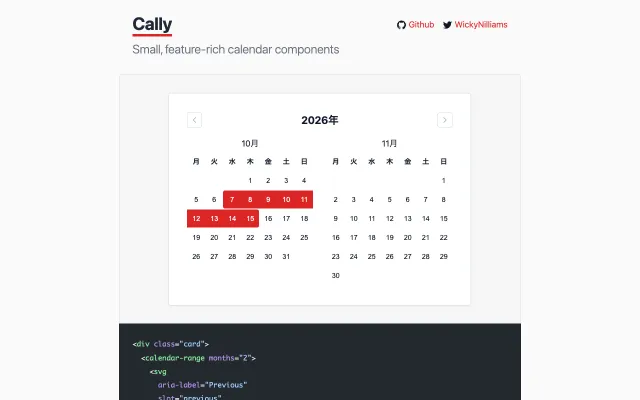 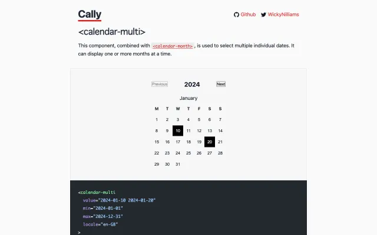 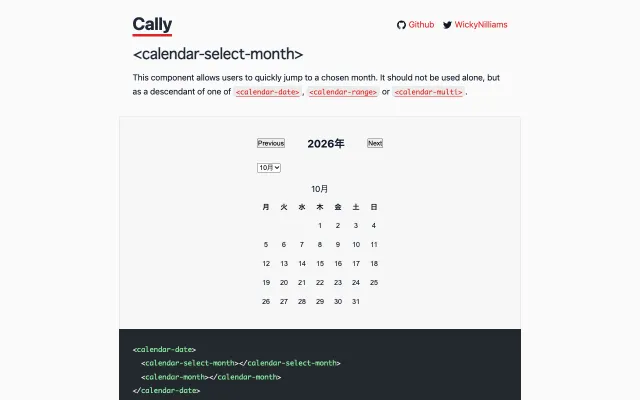 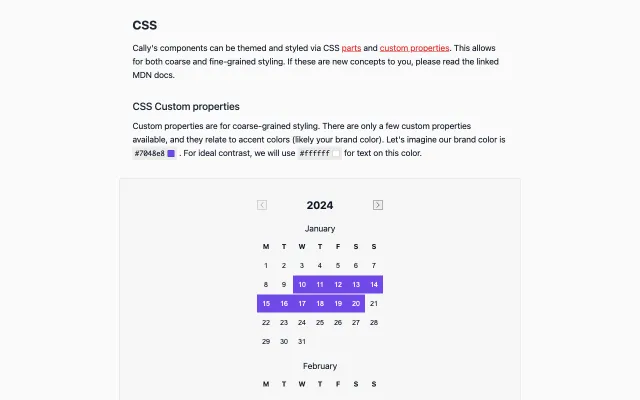
- [gooey-toast](https://github.com/anl331/goey-toast) - React toast whose title pill and description body are drawn as one blob that morphs between pill and expanded shapes. `★ 1.3k` `MIT` `2026-09`
- [hairline](https://github.com/lucasmarkes/hairline) - Thirty-three isometric SVG line figures that react to the pointer, for React or plain DOM with no dependencies. `★ 1.3k` `MIT` `2026-10`
- [slot-text](https://github.com/danielwh2/slot-text) - Slot-machine text roll with zero dependencies, for vanilla JS, React and Vue. `★ 1.0k` `MIT` `2026-09`<br>
  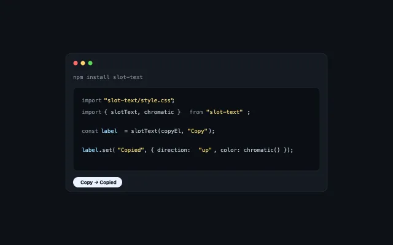
- [ascii.rest](https://github.com/bas3line/ascii) - Animated ASCII art pieces, from a spinning shaded donut to full-colour dot scenes, for React, Astro or one HTML tag. `★ 601` `MIT` `2026-10`
- [Processing](https://github.com/processing/processing4) - Software sketchbook and Java-based language where a short sketch with setup() and draw() opens a graphics window when you press Run. `★ 514` `GPL-2.0 for the editor and other parts, LGPL for the core library, with some bundled third-party code under other licenses (LICENSE.md) ⚠` `2026-09`
- [Mercury](https://github.com/tmhglnd/mercury) - Live coding language for electronic music in Max whose 30-line editor is drawn as large text over full-screen 3D visuals. `★ 378` `GPL-3.0 ⚠` `2026-08`
- [Doodle](https://github.com/creativescala/doodle) - Scala library that builds vector pictures by composing smaller ones with beside, above and on, drawn via Java2D, SVG or Canvas. `★ 349` `Apache-2.0` `2026-09`
- [ol3Echarts](https://github.com/sakitam-fdd/ol3Echarts) - Overlays Apache ECharts series such as migration lines and scatter points on an OpenLayers map, keeping view and coordinates in sync. `★ 333` `MIT` `2026-09`
- [ditherer](https://github.com/gyng/ditherer) - Browser dithering lab with retro CRT and VHS filters, glitch art and audio-reactive visuals. `★ 95` `MIT` `2026-09`<br>
  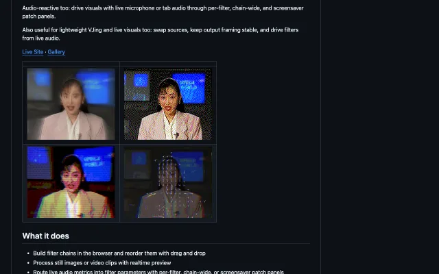 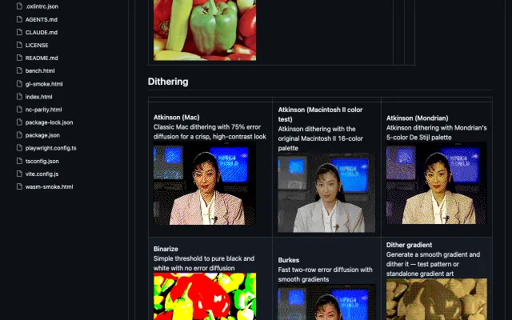 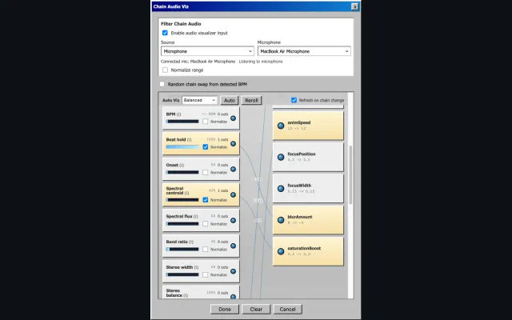 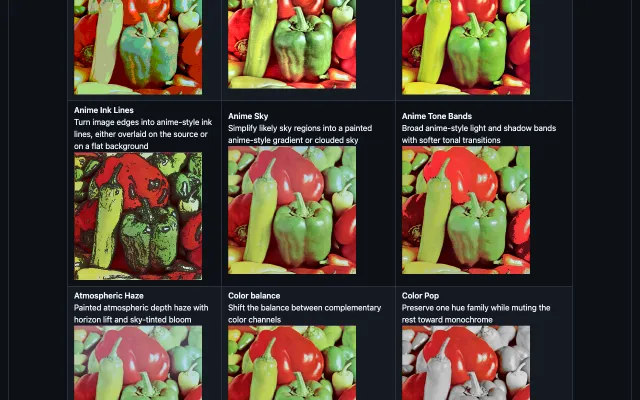

## Motion and text animation

- [anime.js](https://github.com/juliangarnier/anime) - General-purpose JavaScript animation engine. `★ 73k` `MIT` `2026-08`<br>
  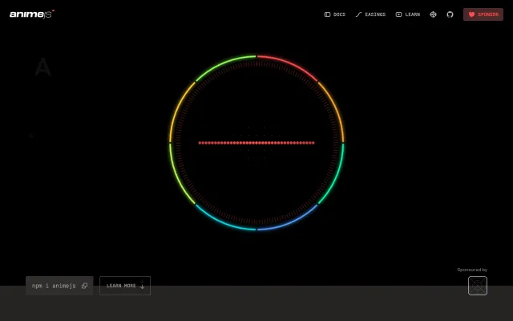 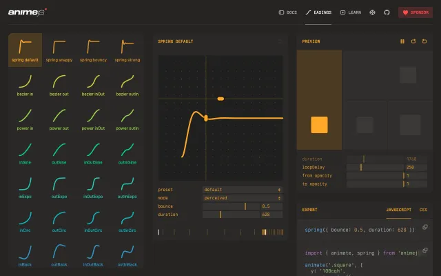
- [Motion](https://github.com/motiondivision/motion) - Animation library for React and JavaScript, formerly Framer Motion. `★ 34k` `MIT` `2026-10`<br>
  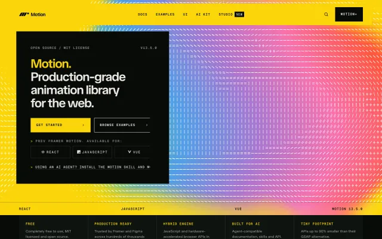 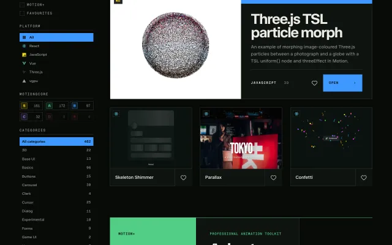 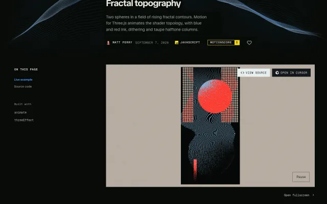 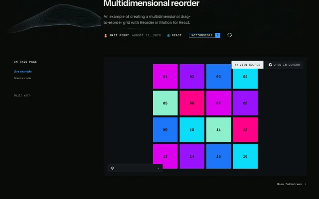
- [react-spring](https://github.com/pmndrs/react-spring) - Spring-physics animation for React. `★ 29k` `MIT` `2026-10`<br>
  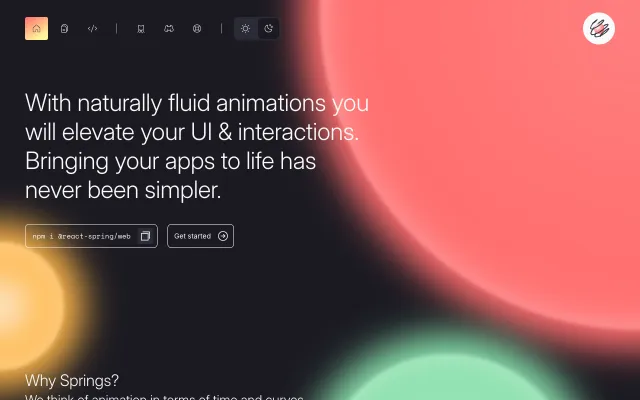 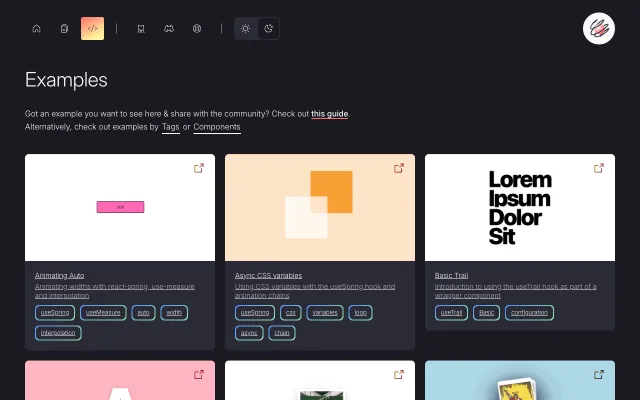 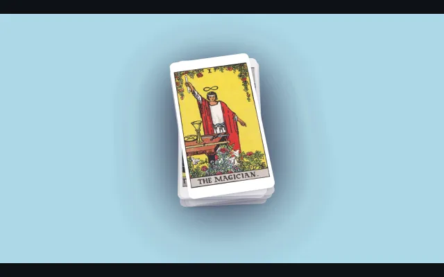 
- [Lenis](https://github.com/darkroomengineering/lenis) - Smooth inertial scrolling. `★ 16k` `MIT` `2026-10`<br>
     
- [AutoAnimate](https://github.com/formkit/auto-animate) - Zero-config, drop-in transitions when elements are added, removed or moved. `★ 14k` `MIT` `2026-07`<br>
   
- [Its Hover](https://github.com/itshover/itshover) - Copy-paste React icons whose individual strokes animate on hover with Motion, installable through the shadcn CLI. `★ 2.7k` `Apache-2.0` `2026-09`
- [react-native-graph](https://github.com/margelo/react-native-graph) - Skia line graph for React Native that morphs between data ranges and dims the line ahead of your finger while you scrub. `★ 2.6k` `MIT` `2026-09`
- [AnimXYZ](https://github.com/ingram-projects/animxyz) - CSS animation library where words in an xyz attribute, such as fade up big, compose one shared keyframe through CSS variables. `★ 2.5k` `MIT` `2026-10`
- [Pixel2Motion](https://github.com/nolangz/pixel2motion) - Agent skill that refits a raster logo into minimal smooth SVG and choreographs a logo reveal as standalone HTML with replay and speed controls. `★ 2.4k` `MIT` `2026-08`
- [simpleParallax.js](https://github.com/geosigno/simpleParallax.js) - Scroll parallax for plain img and video tags in React or vanilla JS, with orientation, scale and delay settings. `★ 2.2k` `MIT` `2026-07`
- [React UseAnimations](https://github.com/useAnimations/react-useanimations) - Lottie-based animated icon set for React whose icons play a short state change on click, such as a star filling or a trash lid lifting. `★ 1.2k` `Custom useAnimations terms: CC BY 4.0 with required attribution to useanimations.com, plus a ban on redistribution or resale of the files ⚠` `2026-10`
- [Rive React](https://github.com/rive-app/rive-react) - React components and hooks that render Rive .riv files, with control of state machines and data-bound view model properties. `★ 1.2k` `MIT` `2026-09`
- [SSGOI](https://github.com/meursyphus/ssgoi) - Page transition library that gives web apps native-style drill, sheet, zoom and film navigation using the Web Animations API. `★ 993` `MIT` `2026-10`
- [lottie-react](https://github.com/Gamote/lottie-react) - React component and hook for Lottie animations, with scroll-scrubbed playback and a ready-made transport control bar. `★ 969` `MIT` `2026-09`
- [dotLottie Web](https://github.com/LottieFiles/dotlottie-web) - Lottie and dotLottie player with a Rust and WASM core, switchable Software, WebGL and WebGPU renderers, and themes and color slots editable at runtime. `★ 892` `MIT` `2026-10`
- [anidoodle](https://github.com/alexgreensh/anidoodle) - Agent skill and Node engine that draws illustrations and animations in 31 hand-made styles from deterministic code, each able to film itself being drawn. `★ 859` `Apache-2.0` `2026-10`
- [Remotion Bits](https://github.com/av/remotion-bits) - Copy-paste animation components for Remotion videos, including text reveals, particle systems and 3D camera scenes. `★ 487` `MIT (declared in package.json and on npm; no LICENSE file in the repository) ⚠` `2026-09`
- [next-transition-router](https://github.com/ismamz/next-transition-router) - Leave and enter callbacks for the Next.js App Router that hold navigation until your GSAP or CSS page transition finishes. `★ 367` `MIT` `2026-10`
- [React Native Animation Samples](https://github.com/Aashu-Dubey/react-native-animation-samples) - Five gesture-driven React Native samples: a scrubbable toolbar, a fanning color swatch, a magnifying icon grid, a bezier rope and an animated text caret. `★ 356` `MIT` `2026-08`

## Components and design systems

- [shadcn/ui](https://github.com/shadcn-ui/ui) - Accessible components you copy into your own codebase and own. `★ 125k` `MIT` `2026-10`<br>
     
- [React Bits](https://github.com/DavidHDev/react-bits) - Large collection of animated, interactive React components. `★ 49k` `MIT + Commons Clause ⚠` `2026-10`<br>
     
- [daisyUI](https://github.com/saadeghi/daisyui) - Component class names on top of Tailwind CSS. `★ 43k` `MIT` `2026-10`<br>
     
- [HeroUI](https://github.com/heroui-inc/heroui) - Modern React UI library, formerly NextUI. `★ 31k` `Apache-2.0` `2026-10`<br>
     
- [Magic UI](https://github.com/magicuidesign/magicui) - Animated components and effects to copy and paste. `★ 23k` `MIT` `2026-10`<br>
     
- [HyperUI](https://github.com/markmead/hyperui) - Free Tailwind CSS components. `★ 12k` `MIT` `2026-09`<br>
     
- [tweakcn](https://github.com/jnsahaj/tweakcn) - Visual theme editor for shadcn/ui. `★ 10k` `Apache-2.0` `2026-09`<br>
     
- [shadcn-svelte](https://github.com/huntabyte/shadcn-svelte) - shadcn/ui for Svelte. `★ 9.2k` `MIT` `2026-10`<br>
     
- [Preline UI](https://github.com/htmlstreamofficial/preline) - Prebuilt Tailwind CSS components. `★ 6.5k` `MIT + Preline Fair Use ⚠` `2026-08`<br>
     
- [Ark UI](https://github.com/chakra-ui/ark) - Unstyled, accessible components for React, Vue, Solid and Svelte. `★ 5.4k` `MIT` `2026-10`<br>
     
- [Dear ImGui Bundle](https://github.com/pthom/imgui_bundle) - Dear ImGui packaged with plotting, node editor and image tools for C++ and Python, with a demo explorer that shows each demo's source. `★ 1.4k` `MIT` `2026-10`
- [React Awesome Button](https://github.com/rcaferati/react-awesome-button) - React button with a raised 3D face that presses down on click, plus a progress variant that fills a loading bar and social share variants. `★ 1.3k` `MIT` `2026-07`
- [SmoothUI](https://github.com/educlopez/smoothui) - Animated React components for shadcn/ui, including a conic-gradient Siri orb, WebGL shader transitions and a Time Machine panel stack. `★ 1.0k` `MIT` `2026-10`
- [interior[.]dev](https://github.com/ddoemonn/interior) - Copy-in React micro-interactions, each a headless hook plus a styled example, such as a slider with detents and a hold-to-confirm button. `★ 824` `MIT` `2026-09`

## WebGL and creative coding

- [three.js](https://github.com/mrdoob/three.js) - The JavaScript 3D library. `★ 116k` `MIT` `2026-10`<br>
     
- [react-three-fiber](https://github.com/pmndrs/react-three-fiber) - React renderer for three.js. `★ 33k` `MIT` `2026-10`<br>
    
- [p5.js](https://github.com/processing/p5.js) - Creative coding for artists, designers and beginners. `★ 24k` `LGPL-2.1 ⚠` `2026-10`<br>
     
- [drei](https://github.com/pmndrs/drei) - Ready-made helpers for react-three-fiber. `★ 9.9k` `MIT` `2026-10`<br>
     
- [tsParticles](https://github.com/tsparticles/tsparticles) - Particles, confetti and fireworks. `★ 9.0k` `MIT` `2026-10`<br>
     
- [react-map-gl](https://github.com/visgl/react-map-gl) - React components that wrap Mapbox GL JS or MapLibre GL JS so the map camera, layers, markers and controls are driven by props. `★ 8.5k` `MIT, with a BSD-style notice for code taken from Mapbox GL JS ⚠` `2026-09`
- [nannou](https://github.com/nannou-org/nannou) - Creative coding framework for Rust. `★ 6.8k` `license: see repo ⚠` `2026-07`<br>
     
- [ThreeUI Community](https://github.com/MengTo/threeui) - React catalog of Three.js scenes, shader backgrounds and liquid-metal buttons, each with live controls and copyable source. `★ 6.5k` `MIT` `2026-09`
- [Shaders](https://github.com/shader-effects-inc/shaders) - About 200 WebGPU effects as nestable layer components for React, Vue, Svelte, Solid and plain JS, from liquid metal to cursor trails. `★ 3.4k` `MIT` `2026-10`
- [react-force-graph](https://github.com/vasturiano/react-force-graph) - React components that render force-directed graphs in 2D canvas, 3D WebGL, VR and AR behind one shared interface. `★ 3.3k` `MIT` `2026-09`
- [gl-react](https://github.com/gre/gl-react) - Write and compose WebGL shaders as React components. `★ 3.0k` `MIT` `2026-10`<br>
     
- [react-postprocessing](https://github.com/pmndrs/react-postprocessing) - Postprocessing effects for react-three-fiber, declared as JSX children of an EffectComposer that merges them into one pass. `★ 1.4k` `MIT` `2026-09`
- [VFX-JS](https://github.com/fand/vfx-js) - Attaches WebGL shader effects such as glitch, RGB shift and rainbow directly to ordinary img, video, div and canvas elements. `★ 1.1k` `MIT` `2026-09`
- [OPENRNDR](https://github.com/openrndr/openrndr) - Kotlin creative coding framework where GLSL shade style snippets restyle any drawn primitive, with contour and shape geometry tools. `★ 981` `BSD-2-Clause (FreeBSD variant with the views-and-conclusions disclaimer, i.e. BSD-2-Clause-Views) ⚠` `2026-10`
- [Fragment](https://github.com/raphaelameaume/fragment) - Local creative coding environment that turns a sketch's exported props into a live control panel beside the canvas, with image and video export. `★ 939` `MIT` `2026-10`
- [Shader Park](https://github.com/shader-park/shader-park-core) - JavaScript library that compiles short sculpting scripts into raymarched signed distance field shaders for three.js, p5, Hydra and TouchDesigner. `★ 825` `MIT` `2026-10`
- [Liquid Glass Studio](https://github.com/iyinchao/liquid-glass-studio) - Browser playground that renders Apple-style liquid glass shapes with refraction, dispersion and merging blobs, tuned live through sliders. `★ 738` `MIT` `2026-09`
- [Shader Lab](https://github.com/basementstudio/shader-lab) - Browser WebGPU editor for stacking and keyframing shader effect layers over video, with a React runtime to embed exports. `★ 699` `Apache-2.0` `2026-10`
- [<shader-doodle />](https://github.com/mmmerl/shader-doodle) - Web component that renders a GLSL fragment shader written inline in HTML, with Shadertoy-style uniforms and image, video, webcam and audio inputs. `★ 588` `MIT` `2026-09`
- [Svader](https://github.com/sockmaster27/svader) - Svelte components that render WebGL or WebGPU fragment shaders, with built-in resolution, scale, time and offset parameters. `★ 465` `MIT` `2026-10`
- [ShaderToy unofficial plugin](https://github.com/patuwwy/ShaderToy-Chrome-Plugin) - Browser extension that adds iTime and iMouse sliders, GPU render timers, a vec3 color picker and export to the Shadertoy editor. `★ 309` `MIT` `2026-10`

## Terminal and TUI

- [lazygit](https://github.com/jesseduffield/lazygit) - Terminal UI for git. `★ 83k` `MIT` `2026-10`<br>
    
- [bat](https://github.com/sharkdp/bat) - A cat clone with syntax highlighting and git integration. `★ 61k` `Apache-2.0` `2026-10`<br>
    
- [Starship](https://github.com/starship/starship) - Fast, customizable prompt for any shell. `★ 60k` `ISC` `2026-10`<br>
     
- [Bubble Tea](https://github.com/charmbracelet/bubbletea) - TUI framework for Go. `★ 45k` `MIT` `2026-10`<br>
     
- [Ink](https://github.com/vadimdemedes/ink) - React for interactive command-line apps. `★ 40k` `MIT` `2026-10`<br>
    
- [Textual](https://github.com/Textualize/textual) - Application framework for terminal UIs in Python. `★ 37k` `MIT` `2026-07`<br>
     
- [btop](https://github.com/aristocratos/btop) - Resource monitor. `★ 35k` `Apache-2.0` `2026-10`<br>
     
- [k9s](https://github.com/derailed/k9s) - Terminal UI for Kubernetes clusters. `★ 35k` `Apache-2.0` `2026-10`<br>
     
- [delta](https://github.com/dandavison/delta) - Syntax-highlighting pager for git, diff and grep output. `★ 32k` `MIT` `2026-10`<br>
     
- [Atuin](https://github.com/atuinsh/atuin) - Searchable, synced shell history. `★ 32k` `MIT` `2026-10`<br>
     
- [difftastic](https://github.com/Wilfred/difftastic) - Structural diff that understands syntax. `★ 26k` `MIT` `2026-10`<br>
     
- [fastfetch](https://github.com/fastfetch-cli/fastfetch) - System information tool in the style of neofetch. `★ 25k` `MIT` `2026-10`<br>
     
- [Gum](https://github.com/charmbracelet/gum) - Styled prompts, spinners and inputs for shell scripts. `★ 24k` `MIT` `2026-09`<br>
    
- [Oh My Posh](https://github.com/JanDeDobbeleer/oh-my-posh) - Cross-shell prompt renderer. `★ 24k` `MIT` `2026-10`<br>
     
- [eza](https://github.com/eza-community/eza) - A modern alternative to ls. `★ 24k` `EUPL-1.2 ⚠` `2026-08`<br>
     
- [Ratatui](https://github.com/ratatui/ratatui) - Rust crate for building terminal UIs. `★ 23k` `MIT` `2026-10`<br>
     
- [gitui](https://github.com/gitui-org/gitui) - Terminal UI for git, written in Rust. `★ 23k` `MIT` `2026-10`<br>
     
- [VHS](https://github.com/charmbracelet/vhs) - Records terminal sessions as GIFs from a script. `★ 21k` `MIT` `2026-10`<br>
     
- [ccstatusline](https://github.com/sirmalloc/ccstatusline) - Status line formatter for Claude Code with Powerline segments that auto-align into columns across multiple lines and a TUI configurator. `★ 13k` `MIT` `2026-10`
- [gping](https://github.com/orf/gping) - Ping, but with a graph. `★ 13k` `MIT` `2026-10`<br>
     
- [onefetch](https://github.com/o2sh/onefetch) - Git repository summary in the terminal. `★ 12k` `MIT` `2026-10`<br>
     
- [Lip Gloss](https://github.com/charmbracelet/lipgloss) - Style definitions for terminal layouts. `★ 12k` `MIT` `2026-10`<br>
     
- [Symfony Console](https://github.com/symfony/console) - PHP library for command line output with format-string progress bars, styled tables, result blocks and rewritable output sections. `★ 9.8k` `MIT` `2026-10`
- [Clack](https://github.com/bombshell-dev/clack) - Building blocks for beautiful command-line prompts. `★ 8.1k` `MIT` `2026-10`<br>
   
- [iocraft](https://github.com/ccbrown/iocraft) - Rust crate for terminal UIs and styled text output, declared React-style with an element! macro, hooks and flexbox layout. `★ 1.6k` `Apache-2.0` `2026-10`
- [Golazo](https://github.com/0xjuanma/golazo) - Terminal football tracker with a block-digit scoreboard and a two-sided, minute-by-minute event timeline for each match. `★ 868` `MIT` `2026-09`
- [listr2](https://github.com/listr2/listr2) - Node.js task list renderer that redraws a nested tree of concurrent tasks in place with spinners and status icons. `★ 691` `MIT` `2026-10`
- [WAHA TUI](https://github.com/muhammedaksam/waha-tui) - Terminal WhatsApp client with a WhatsApp Web style two-pane layout, message bubbles with quoted replies, and QR code pairing drawn in the terminal. `★ 405` `MIT` `2026-10`
- [wifitui](https://github.com/shazow/wifitui) - Terminal Wi-Fi manager for NetworkManager with gradient-colored signal strength, fuzzy filtering and QR code network sharing. `★ 343` `MIT` `2026-09`
- [ProteinView](https://github.com/001TMF/ProteinView) - Terminal viewer for PDB/mmCIF molecular structures that draws 3D cartoon ribbons in braille or Kitty/Sixel pixel graphics. `★ 337` `MIT` `2026-07`
- [Rura](https://github.com/tlipinski/rura) - Terminal UI for building a shell pipeline step by step, with the output shown above the command line and a diff mode between runs. `★ 337` `MIT` `2026-09`
- [HexPatch](https://github.com/Etto48/HexPatch) - Terminal hex editor that disassembles binaries and lets you type assembly to patch them, showing the resulting bytes as you write. `★ 336` `AGPL-3.0 ⚠` `2026-08`
- [lssh](https://github.com/blacknon/lssh) - SSH client that picks hosts from a filterable list, runs commands in parallel and opens a built-in multi-pane mux across servers. `★ 327` `MIT` `2026-07`
- [pnana](https://github.com/Cyxuan0311/PNANA) - Terminal text editor built on FTXUI with a command palette, fuzzy file finder with preview pane, split views and in-editor image preview. `★ 327` `MIT` `2026-10`
- [TermDOM](https://github.com/bikeshaving/termdom) - Renders real HTML, CSS and DOM nodes to terminal cells, so TUIs are written like web pages and repaint on mutation. `★ 326` `MIT` `2026-10`
- [mirador](https://github.com/jchultarsky/mirador) - Terminal dashboard of clock, calendar, tasks, notes and system panels that dims all but the focused one and rearranges by keyboard. `★ 324` `MIT` `2026-10`
- [shiki](https://github.com/sazardev/shiki) - Terminal note-taking app with a three-pane Miller-column browser, rendered Markdown preview, and git branch and commit controls per notebook. `★ 324` `MIT` `2026-10`
- [tori](https://github.com/thobiasn/tori-cli) - Docker server monitoring TUI over SSH with braille sparklines, grouped containers, alerts and log tailing. `★ 318` `MIT` `2026-10`
- [sabiql](https://github.com/riii111/sabiql) - Vim-keyed terminal client for PostgreSQL, MySQL and SQLite that shows a diff, the SQL and a risk level before applying an edit. `★ 317` `MIT` `2026-10`
- [dtui](https://github.com/Troels51/dtui) - Terminal browser for D-Bus services with an object tree and a method call form that checks typed arguments. `★ 317` `MIT` `2026-08`
- [Pensar Apex](https://github.com/pensarai/apex) - Terminal app for AI agent penetration testing, with a green ASCII density-shaded banner over a centered command prompt. `★ 316` `Apache-2.0` `2026-10`
- [Piou](https://github.com/Andarius/piou) - Python CLI library whose typed commands also run as a slash-command TUI with live suggestions and argument hints. `★ 315` `MIT` `2026-10`
- [ratatui-hypertile](https://github.com/nikolic-milos/ratatui-hypertile) - Hyprland-style BSP tiling for Ratatui apps, with animated pane moves, mouse-dragged split borders and a plugin palette. `★ 314` `MIT` `2026-10`
- [ec](https://github.com/chojs23/ec) - Terminal Git conflict resolver with ours, result and theirs panes, a live preview of the pending resolution, and a split or unified diff viewer. `★ 313` `MIT` `2026-09`
- [Hazelnut](https://github.com/ricardodantas/hazelnut) - Terminal file organizer that watches folders and applies TOML rules, with a 15-theme picker showing color swatches per theme. `★ 312` `GPL-3.0 ⚠` `2026-09`
- [drydock](https://github.com/yetidevworks/drydock) - Terminal dashboard that shows uncommitted, unpushed and unreleased work across hundreds of git repos in one colour-coded table. `★ 310` `MIT` `2026-10`
- [mandown](https://github.com/Titor8115/mandown) - Terminal Markdown pager in C that lays documents out like man pages, with indented sections and a status line. `★ 307` `GPL-3.0 ⚠` `2026-08`
- [cli-chess](https://github.com/trb346/cli-chess) - Terminal chess client with a colored Unicode board, playable offline against Fairy-Stockfish or online through Lichess, including watching Lichess TV. `★ 307` `GPL-3.0 ⚠` `2026-09`
- [gtt](https://github.com/eeeXun/gtt) - Terminal translator with side by side source and target panes plus definition and part of speech panes, backed by seven translation engines. `★ 306` `MIT` `2026-09`
- [fzf-make](https://github.com/kyu08/fzf-make) - Fuzzy finder TUI for make, npm, pnpm, yarn, just and task that previews the selected target's source before running it. `★ 306` `MIT` `2026-09`
- [pgtui](https://github.com/pgplex/pgtui) - Terminal client for PostgreSQL with a schema tree, tabbed table views, a JSONB tree viewer and a Ctrl+K command palette. `★ 305` `Apache-2.0` `2026-08`
- [OSTT](https://github.com/kristoferlund/ostt) - Terminal voice-to-text popup that draws a live mirrored waveform while recording, then pastes the transcript. `★ 303` `MIT` `2026-10`
- [aerc](https://github.com/rjarry/aerc) - Terminal email client that composes mail in an embedded editor tab, tmux-style, with vim-like keybindings and ex commands. `★ 302` `MIT` `2026-09`
- [LazyWorktree](https://github.com/chmouel/lazyworktree) - Keyboard-first TUI for Git worktrees with PR and CI status, per-worktree notes, a taskboard and an agent sessions pane. `★ 301` `Apache-2.0` `2026-10`

## Widgets and building blocks

- [Floating UI](https://github.com/floating-ui/floating-ui) - Positions tooltips, popovers and dropdowns. `★ 33k` `MIT` `2026-09`<br>
     
- [Recharts](https://github.com/recharts/recharts) - Chart library built with React and D3. `★ 28k` `MIT` `2026-10`<br>
     
- [Lucide](https://github.com/lucide-icons/lucide) - Consistent, community-made icon set. `★ 25k` `ISC` `2026-10`<br>
     
- [dnd kit](https://github.com/clauderic/dnd-kit) - Toolkit for drag and drop interfaces. `★ 18k` `MIT` `2026-09`<br>
     
- [Sonner](https://github.com/emilkowalski/sonner) - The toast component many others are measured against. `★ 13k` `MIT` `2026-08`<br>
   
- [react-hot-toast](https://github.com/timolins/react-hot-toast) - Lightweight toast notifications for React. `★ 11k` `MIT` `2026-09`<br>
   
- [wavesurfer.js](https://github.com/katspaugh/wavesurfer.js) - Audio waveform player. `★ 10k` `BSD-3-Clause` `2026-10`<br>
    
- [React DayPicker](https://github.com/gpbl/react-day-picker) - Date picker and calendar component for React. `★ 6.9k` `MIT` `2026-09`<br>
     
- [kbar](https://github.com/timc1/kbar) - Command palette for React. `★ 5.3k` `MIT` `2026-08`<br>
   
- [@hello-pangea/dnd](https://github.com/hello-pangea/dnd) - Accessible drag and drop for lists in React. `★ 4.0k` `Apache-2.0` `2026-10`<br>
    

## Quiet classics

No push in the last 3 months, or archived. Many of these are simply finished. They move back up on their own when development resumes.

- [Rich](https://github.com/Textualize/rich) - Rich text and beautiful formatting in the terminal, for Python. `★ 57k` `MIT` `2026-06`<br>
     
- [lazydocker](https://github.com/jesseduffield/lazydocker) - Terminal UI for Docker. `★ 53k` `MIT` `2026-04`<br>
   
- [lottie-web](https://github.com/airbnb/lottie-web) - Renders After Effects animations on the web. `★ 32k` `MIT` `2025-09`<br>
    
- [Hover.css](https://github.com/IanLunn/Hover) - A collection of CSS hover effects. `★ 29k` `license: see repo ⚠` `2023-10`<br>
   
- [GSAP](https://github.com/greensock/GSAP) - The long-standing professional animation platform for the web. `★ 29k` `custom ⚠` `2026-04`<br>
    
- [AOS](https://github.com/michalsnik/aos) - Animate elements as they scroll into view. `★ 28k` `MIT` `2024-03`<br>
   
- [visx](https://github.com/airbnb/visx) - Low-level visualization components for React. `★ 21k` `MIT` `2026-06`<br>
     
- [SpinKit](https://github.com/tobiasahlin/SpinKit) - CSS loading spinners. `★ 19k` `MIT` `2020-08`<br>
    
- [WebGL Fluid Simulation](https://github.com/PavelDoGreat/WebGL-Fluid-Simulation) - The fluid simulation everyone has played with. `★ 17k` `MIT` `2024-11`<br>
    
- [typed.js](https://github.com/mattboldt/typed.js) - The typewriter effect. `★ 16k` `license: see repo ⚠` `2026-01`<br>
     
- [cmdk](https://github.com/dip/cmdk) - The reference command menu component for React. `★ 13k` `MIT` `2025-10`<br>
    
- [canvas-confetti](https://github.com/catdad/canvas-confetti) - Confetti on a canvas. `★ 13k` `ISC` `2025-10`<br>
   
- [Theatre.js](https://github.com/theatre-js/theatre) - Motion design editor with a timeline, for the web. `★ 13k` `Apache-2.0` `2024-08`<br>
     
- [Flowbite](https://github.com/themesberg/flowbite) - Component library built on Tailwind CSS. `★ 9.4k` `MIT` `2026-06`<br>
     
- [CountUp.js](https://github.com/inorganik/countUp.js) - Animates a number by counting up to it. `★ 8.2k` `MIT` `2026-07`<br>
   
- [Vanta.js](https://github.com/tengbao/vanta) - Animated 3D backgrounds in a few lines. `★ 7.1k` `MIT` `2024-03`<br>
     
- [canvas-sketch](https://github.com/mattdesl/canvas-sketch) - Framework for generative artwork in JavaScript. `★ 5.3k` `MIT` `2026-06`<br>
     
- [vanilla-tilt.js](https://github.com/micku7zu/vanilla-tilt.js) - Smooth 3D tilt on hover. `★ 4.0k` `MIT` `2024-03`<br>
     
- [Hydra](https://github.com/hydra-synth/hydra) - Live-coded video synth in the browser: oscillators, kaleidoscopes, modulation and feedback. `★ 2.7k` `AGPL-3.0 ⚠` `2026-04`<br>
    
- [use-scramble](https://github.com/tol-is/use-scramble) - React hook for a clean scramble (decrypt) text effect. `★ 146` `MIT` `2026-03`<br>
  
<!-- LIST:END -->

## How the list stays current

Everything between the list markers in this file is generated. The curated part lives in [`list.json`](./list.json): the repository, a display name, a section and a one-line note.

```sh
python3 scripts/build.py
```

The script needs Python 3.9 or newer, no packages to install, and a GitHub token: it reads `GITHUB_TOKEN`, or asks the `gh` CLI if you are logged in. For each entry it fetches the current stars, license and last push, sorts each section by stars, and moves anything archived or without a push in three months to Quiet classics. If development resumes, the next run moves it back. Repositories returning 404 are skipped with a warning and remain in `list.json` for audit; other API errors stop the build.

## Agent skills

This repository is also an [Agent Plugins 1.0](https://agent-plugins.org) plugin: a `plugin.json` at the root and four skills under [`skills/`](./skills). An AI coding agent that supports the format can use them to do the research behind the list.

| Step | Skill | What it does | Defined in | Result |
|---|---|---|---|---|
| 1 | `find-candidates` | Searches GitHub for active projects not yet listed | [`queries.json`](./skills/find-candidates/queries.json) | `research/candidates.json` |
| 2 | `research-candidates` | One subagent per repository records what it is and what is distinctive | [`researcher-brief.md`](./skills/research-candidates/references/researcher-brief.md) | `research/findings/*.json` |
| 3 | `judge-candidates` | A script applies the inclusion rules to the findings | [`rules.json`](./skills/judge-candidates/rules.json) | `research/verdicts.json` |
|  | `audit-list` | Finds entries that moved, were archived or deleted, or have an unresolved license |  | printed |

The agent researches, but it does not decide. Whether a repository gets in is computed from its finding file by `judge.py`, which has no network access and no judgement of its own, so the same findings, rules and evaluation date give the same verdict:

```sh
python3 skills/judge-candidates/scripts/judge.py
```

`research/verdicts.json` is generated and ignored by Git. Use `--as-of YYYY-MM-DD` to reproduce verdicts for a fixed date. Missing or malformed observations, unresolved licenses, and recorded unverified claims require more research before inclusion. Discovery excludes all existing findings and defaults to low-star candidates first.

## Install the agent plugin

### Use with Codex or Claude Code

Both clients use the same four skills. Codex reads the root Agent Plugins 1.0 manifest; Claude Code uses the compatibility manifest in `.claude-plugin/plugin.json`. See the [Agent Plugins client list](https://agent-plugins.org/compatible-clients), [Codex packaging guide](https://developers.openai.com/plugins/build/plugins), and [Claude Code manifest reference](https://code.claude.com/docs/en/plugins-reference).

Run these workflows from a writable checkout of this repository, with Python 3.9+ and GitHub authentication available. The skills operate on the checkout's `list.json` and `research/`; an installed plugin cache is not the working checkout.

For Codex, run from this repository:

```sh
codex plugin marketplace add .
codex plugin add awesome-beautiful-ui@awesome-beautiful-ui-local
```

Start a new Codex session in this checkout and ask it to use `find-candidates`, `research-candidates`, `judge-candidates`, or `audit-list` from Awesome Beautiful UI.

For Claude Code, load the checkout for one session:

```sh
claude --plugin-dir .
```

Then invoke, for example, `/awesome-beautiful-ui:find-candidates`. To install persistently instead:

```sh
claude plugin marketplace add .
claude plugin install awesome-beautiful-ui@awesome-beautiful-ui-local
```

Restart the client after installation. Installing the plugin does not itself run a search or change the list.

### Verify the harness

```sh
python3 -m unittest
```

The standard-library suite uses `tests/fixtures/findings/`, temporary output files, and mocked GitHub responses. No token or network access is required.

### Maintain plugin packaging

`plugin.json` is the source of truth for plugin metadata. The compatibility manifest and the two client marketplace catalogs are generated:

```sh
python3 scripts/sync_plugin.py
python3 scripts/sync_plugin.py --check
claude plugin validate .claude-plugin/plugin.json --strict
claude plugin validate .claude-plugin/marketplace.json --strict
```

The marketplace catalogs are client-specific distribution files, outside the portable Agent Plugins core. Do not copy the skill implementations into client-specific directories.

## Contributing

Suggestions are welcome. See [CONTRIBUTING.md](./CONTRIBUTING.md).

## License

[MIT](./LICENSE)
